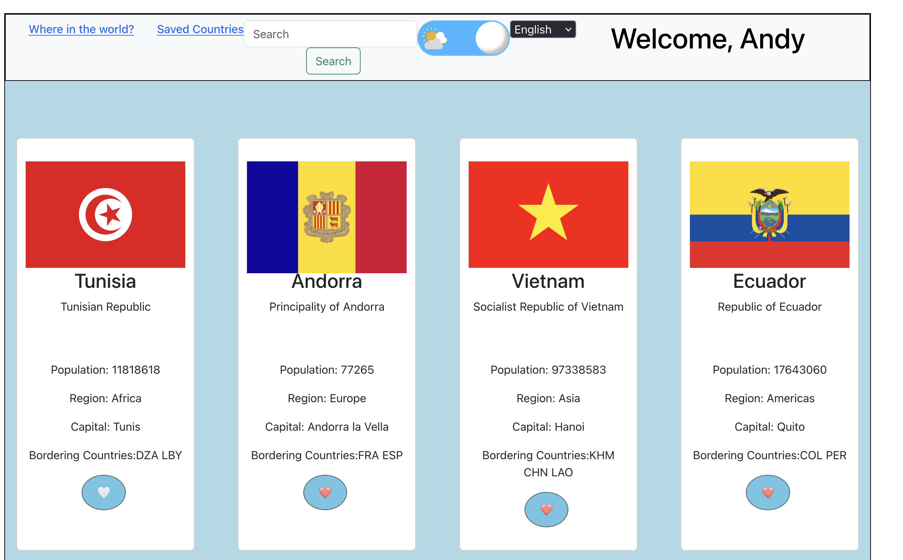
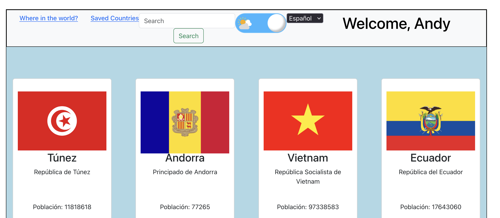

# 🌍 V5 Countries API Application

## 📌 Description

The **Countries API Application** allows users to browse, search, and save information about countries around the world, delivering real-time data and a smooth user experience via a modern web stack. This project was built as part of AnnieCannons’ backend/full-stack development training to showcase skills in React, Node.js/Express APIs, and PostgreSQL databases.

**Purpose:**

- Practice and demonstrate full-stack app development, including both frontend and backend.
- Help users explore country data and practice working with RESTful APIs, backend persistence, and data visualization.

## 🚀 Live Site

[View the Live Site](https://astonishing-crumble-fe780c.netlify.app/)

## 🖼️ Screenshots

Front page of app (default English setting):

Spanish version (I had some trouble getting the language-changer to display the correct continent and capital names translated, since afaik these aren't in the REST Countries API):

## ✨ Features

- **Home Page:** Browse and search for country data; view countries' flags, populations, capitals, neighbors, etc..
- **Country Detail Page:** See detailed info for a selected country and track how many times it’s been viewed.
- **Saved Countries Page:** View and manage a list of countries you’ve saved.
- **Welcome Banner:** Personalized greeting by name after form submission (simple, not full login).
- **Responsive UI:** Adapts layout for different screen sizes.
- **Translation:** Translates country and information label names to Spanish French, and Russian.
- **Search Bar\*:** Allows users to search for a specific country.

## 🛠️ Tech Stack

**Frontend**

- **Languages:** HTML, CSS (tailwind used for some features), JavaScript,
- **Framework:** React
- **Deployment:** Netlify

**Server/API**

- **Languages:** JavaScript
- **Framework:** Node.js, Express
- **Deployment:** Render

**Database**

- **System:** PostgreSQL
- **Cloud Hosting:** Neon.tech

**Other Data/APIs**

- [REST Countries API](https://restcountries.com) (real-time country data)
- Custom Express API (handles view counts, user name, saved countries, etc.)

## 💭 Reflections

- **What I learned:**  
  Setting up, testing, and debugging RESTful APIs and connecting frontend to backend with async fetch calls; configuring and deploying a Postgres database; managing project structure across multiple iterations.

- **What I'm proud of:**  
  Creating my own backend, then deploying both API and database to production services.Though I didn't get as far as I wanted, was also proud of figuring out how to add multilingual functionality

- **What was challenging:**  
  Coordinating data between frontend state and remote backend, handling async API errors, and debugging deployment environment variables/config. Imo backend tends to be harder to get my head around, because the logic isn't all in one place. This was the biggest challenge.

- **Future plans:**  
  Add authentication for multi-user support and persistent usage; complete translation functionality; migrate to Astro; include more data on detail page.

## 🙌 Credits

- [Figma design file](https://www.figma.com/design/YuEMNteoQic0h6RRiYprpV/Countries-API-Project?m=auto)
- [REST Countries API](https://restcountries.com)
- Shoutout to Arianna, Makeba, Bakari, and Cassy for help w/ varies pieces of this project.
